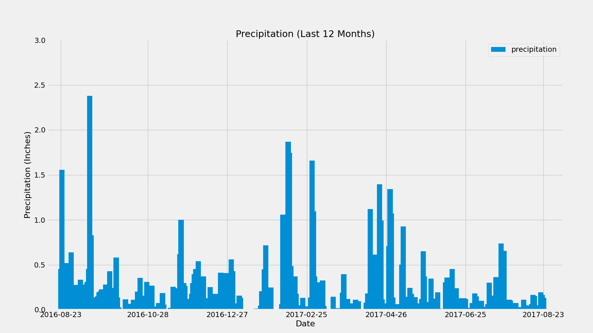
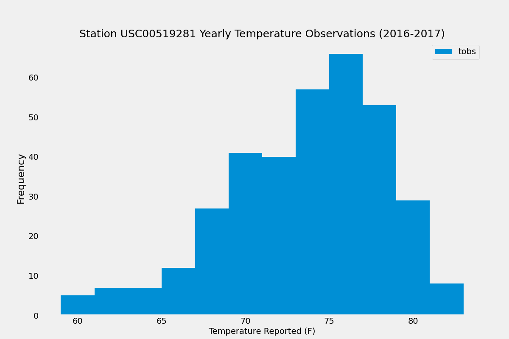

# sqlalchemy-challenge
Module 10 Challenge

Congratulations! You've decided to treat yourself to a long holiday vacation in Honolulu, Hawaii. To help with your trip planning, you decide to do a climate analysis about the area. The following sections outline the steps that you need to take to accomplish this task.

## Part 1: Analyze and Explore the Climate Data

In this section, you’ll use Python and SQLAlchemy to do a basic climate analysis and data exploration of your climate database. Specifically, you’ll use SQLAlchemy ORM queries, Pandas, and Matplotlib. To do so, complete the following steps:

1. Note that you'll use the provided files (`climate_starter.ipynb` and `hawaii.sqlite`) to complete your climate analysis and data exploration
2. Use the SQLAlchemy `create_engine()` function to connect to your SQLite database.
3. Use the SQLAlchemy `automap_base()` function to reflect your tables into classes, and then save references to the classes named `station` and `measurement`.
4. Link Python to the database by creating a SQLAlchemy session.
5. Perform a precipitation analysis and then a station analysis by completing the steps in the following two subsections.

## Precipitation Analysis

1. Find the most recent date in the dataset.
2. Useing that date, get the previous 12 months of precipitation data by querying the previous 12 months of data.
3. Select only the 'date' and the 'prcp' values.
4. Load the query results into a Pandas DataFrame. Explicitly set the column names.
5. Sort the DataFrame values by 'date'.
6. Plot the results by using the DataFrame `plot` method, as the following image shows:

  
  
 7. Use Pandas to print the summary statistics for the precipitation data.

##Station Analysis

1. Design a query to calculate the totla number of stations in the dataset.
2. Design a query to find the most-active stations (that is, the stations that have the most rows). To do so, complete the following steps:
* List the stations and observation counts in descending order.
* Answer the following question: which station ID has the greatest number of observations?
3.Design a query that calculates the lowest, highest, and average temperatures that filters on the most-active station id found in the previous query.
4. Design a query to get the previous 12 months of temperature observation (TOBS) data. To do so, complete the following steps:
* Filter by the station that has the greatest number of observations.
* Query the previous 12 months of TOBS data for that station.
* Plot the results as a histogram with `bins=12`, as the following image shows:

  
  
5. Close your session.

